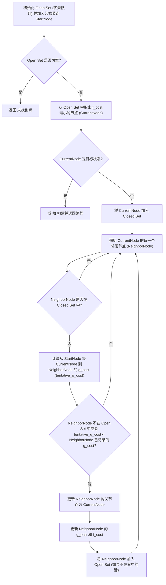

# NUAA 人工智能导论 实验: 十四数码问题 (双空格) A* 求解器

## 实验内容
将原十五数码问题（$4 \times 4$ 棋盘，15个数字，1个空格）修改为十四数码问题，即在一个 $4 \times 4$ 的棋盘上，有14个数字棋子（从1到14）和**2个空格**。本实验旨在实现给定某个初始布局情况及目标布局情况，设计并实现 A* 算法，找出从初始状态到目标状态所需的最少移动棋子的步骤。

## 什么是A*算法
A* (A-star) 算法是一种经典的启发式搜索算法，用于在图中寻找从给定起点到终点的最短路径。它通过一个评估函数 $f(n) = g(n) + h(n)$ 来确定下一个要探索的节点：
- $g(n)$: 从起点到节点 $n$ 的实际代价（例如，在十四数码问题中，这是已经移动的步数）。
- $h(n)$: 从节点 $n$ 到目标节点的估计代价（启发式函数）。这是一个基于问题特性的估计值。
- $f(n)$: 节点 $n$ 的综合优先级。A* 算法总是优先选择 $f(n)$ 值最小的节点进行扩展。

A* 算法使用一个优先队列（通常是最小堆）来存储待访问的节点（称为 Open Set），并使用一个集合来存储已访问过的节点（称为 Closed Set），以避免重复计算和循环。

其核心流程可以用下图表示：



## 启发函数设计 (Heuristic Function Design)
对于十四数码问题（双空格），一个仍然良好且常用的启发函数是**曼哈顿距离 (Manhattan Distance)**。

**曼哈顿距离**:
对于棋盘上的每一个数字棋子（1到14），计算其当前位置到目标位置的水平距离和垂直距离之和。所有14个数字棋子的曼哈顿距离总和即为当前状态的 $h(n)$ 值。
例如，如果棋子 '7' 当前在 `(r1, c1)` 位置，其目标位置是 `(r2, c2)`，则该棋子的曼哈顿距离为 `|r1 - r2| + |c1 - c2|`。
两个空格（通常用0表示）不计入曼哈顿距离。

选择曼哈顿距离是因为：
1.  **计算相对简单**：易于实现和计算。
2.  **信息量较好**：能提供关于"离目标有多远"的信息，从而有效地指导搜索。
3.  **可采纳性 (Admissibility)**：这是启发函数的一个重要性质。对于双空格问题，只要移动操作定义为单个棋子移动到空格，曼哈顿距离仍然是可采纳的，因为它不会高估实际到达目标所需的步数。

### 启发函数的限制条件
为了保证 A* 算法找到最优解（即最短路径），启发函数 $h(n)$ 必须满足**可采纳性 (Admissible Heuristic)**: 对于所有的节点 $n$, $h(n)$ 必须小于或等于从节点 $n$ 到目标节点的实际最小代价 $h^*(n)$。曼哈顿距离满足此条件。

## Python 代码实现
本实验使用 Python 语言实现 A* 算法来解决十四数码（双空格）问题。
核心代码位于 `fifteen_puzzle_solver.py` 文件中 (文件名保留，但内容已修改)。

主要组成部分：
- `PuzzleNode` 类: 用于表示棋盘的每一个状态，包含状态本身（现在包含两个用0表示的空格）、父节点、到达此状态的g值（步数）、启发式h值（曼哈顿距离）和f值。能够识别并处理两个空格。
- `solve_15_puzzle` 函数 (可考虑重命名为 `solve_puzzle`): A* 算法主逻辑，使用优先队列管理待探索的节点。
- **可解性判断**: 对于标准的单空格N-Puzzle，存在基于逆序数和空格位置的可解性判断规则。然而，对于双空格的十四数码问题，可解性判断规则更为复杂，并且**当前版本的代码没有实现此类检查**。程序会尝试求解任何给定的初始状态。
- 启发函数计算: 在 `PuzzleNode` 类中实现曼哈顿距离的计算，忽略两个空格。

## 实验样例 (Experiment Examples)
本文定义了双空格的目标状态之一（例如，两个空格位于棋盘的最后两个位置）：
```
  1   2   3   4
  5   6   7   8
  9  10  11  12
 13  14   .   .  ( . 表示空块 0)
```

以下是一个实验用的初始状态样例 (已在 `fifteen_puzzle_solver.py` 中定义并用于测试)：

**样例1 (简单, 2步可解至上述目标):**

```
  1   2   3   4
  5   6   7   8
  9  10  11   .
 13  14  12   . 
```
(棋子12可移动到第一个空格处达到目标)

**样例2**

```text
初始状态:
  1   2   3   4
  5   6   7   8
  9  10  11  12
 13  14   .   .
---------------
目标状态:
  1   2   3   4
  5   6   7   8
  9  10  13  12
 11  14   .   .
---------------
```

**输出：**

```
找到解决方案! 移动步数: 14
扩展节点数: 199
详细步骤:
步骤 0:
  1   2   3   4
  5   6   7   8
  9  10  11  12
 13  14   .   .
---------------
步骤 1:
  1   2   3   4
  5   6   7   8
  9  10  11  12
 13   .  14   .
---------------
步骤 2:
  1   2   3   4
  5   6   7   8
  9  10  11  12
  .  13  14   .
---------------
步骤 3:
  1   2   3   4
  5   6   7   8
  9  10  11  12
  .  13   .  14
---------------
步骤 4:
  1   2   3   4
  5   6   7   8
  9  10   .  12
  .  13  11  14
---------------
步骤 5:
  1   2   3   4
  5   6   7   8
  9   .  10  12
  .  13  11  14
---------------
步骤 6:
  1   2   3   4
  5   6   7   8
  9  13  10  12
  .   .  11  14
---------------
步骤 7:
  1   2   3   4
  5   6   7   8
  9  13  10  12
  .  11   .  14
---------------
步骤 8:
  1   2   3   4
  5   6   7   8
  9  13  10  12
 11   .   .  14
---------------
步骤 9:
  1   2   3   4
  5   6   7   8
  9   .  10  12
 11  13   .  14
---------------
步骤 10:
  1   2   3   4
  5   6   7   8
  9  10   .  12
 11  13   .  14
---------------
步骤 11:
  1   2   3   4
  5   6   7   8
  9  10   .  12
 11   .  13  14
---------------
步骤 12:
  1   2   3   4
  5   6   7   8
  9  10  13  12
 11   .   .  14
---------------
步骤 13:
  1   2   3   4
  5   6   7   8
  9  10  13  12
 11   .  14   .
---------------
步骤 14:
  1   2   3   4
  5   6   7   8
  9  10  13  12
 11  14   .   .
---------------
```

## 实验样例描述 
`fifteen_puzzle_solver.py` 脚本的 `main` 函数中包含了上述样例以及对应的目标状态。
运行脚本后，程序会：
1.  尝试使用 A* 算法 (`solve_15_puzzle` 函数) 进行求解。
2.  输出找到的解决方案的移动步数和算法过程中扩展的节点数。
3.  如果找不到解（可能因为初始状态确实无解，或搜索空间过大），会提示未找到解决方案。

## 结果与分析

- **求解效率**: A* 算法在曼哈顿距离的指导下，能够有效地找到十四数码（双空格）问题的最优解（即最少移动步数），如果解存在并且在计算资源允许的范围内。
- **扩展节点数**: 扩展的节点数是衡量搜索效率的一个指标。
- **启发函数的重要性**: 曼哈顿距离是有效的。
- **关于可解性**: 由于双空格问题的可解性判断的复杂性，并非所有随机生成的初始状态都保证有解。当前暂不进行此判断。

通过运行实验，可以观察到不同初始状态下的求解步数和算法效率，从而加深对 A* 算法及其启发函数作用的理解，并认识到问题变体（如双空格）可能带来的额外复杂性。